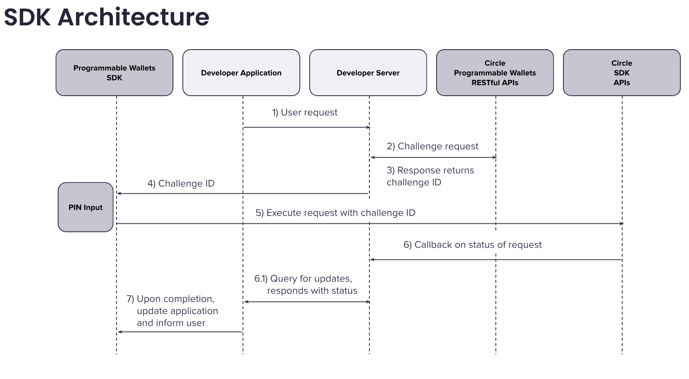
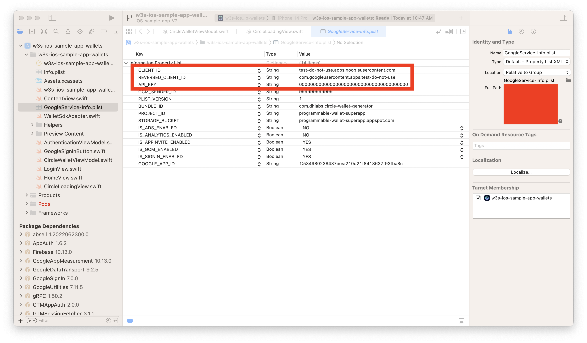
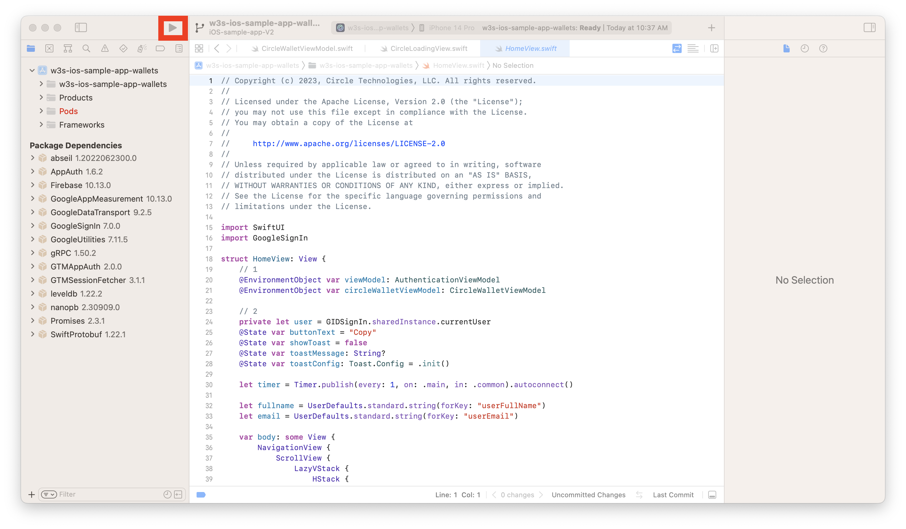
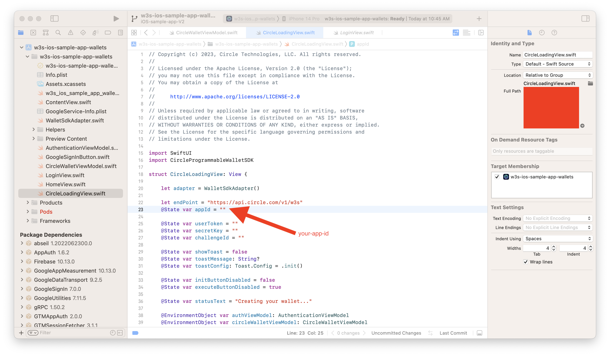

# Web3 Wallet Address Generator

Welcome to the Web3 Wallet Address Generator repository! This sample iOS app provides developers with foundation for creating web3 wallet addresses after a user has completed a social sign-in through Apple or Google. 

### Overview

The Web3 Wallet Address Generator demonstrates the integration of social sign-in functionality with web3 wallet address generation in an iOS app. It leverages the authentication capabilities provided by Google and Apple, enabling users to seamlessly login to the app using their Apple or Google accounts. Upon successful authentication, the app generates a web3 wallet address for the user, which can be used to securely store and manage digital assets or currencies such as USDC on the blockchain. 

### Key Features
* Deploy, embed, and manage wallet transactions in your app with REST API
* Advanced security through Multi-Party Computation(MPC) technology, ensuring enhanced protection of user assets and reducing single points of failure
* Flexible custody models allowing developers to choose between user-controlled wallets or developer-controlled wallets based on the needs
* Currently supports Ethereum, Polygon, and Avalanche, with other chains coming soon

## Get Support

If you have questions, comments, or need help with code, we're here to help:

* on [Discord](https://discord.com/invite/buildoncircle)
* on Twitter at [@BuildOnCircle](https://twitter.com/BuildOnCircle)

Check out our [developer docs](https://developers.circle.com/w3s/docs).

## Requirements

### Circle Developer Account
Sign up for the Circle Developer account here:https://console.circle.com/signup.

Within the Circle Developer account, you can create and update API Keys, subscribe for activity notifications, view your API logs and more! Anyone can sign up for a Circle Developer account within minutes. All you need is your name, email and password!

### Test Server
Setup a developer server in order to simulate the initialization and creation of wallets by cloning our [repo](https://github.com/circle-ccooper/circle-programmable-wallet-test-server) and following provided instructions.


### Xcode
Install Apple’s Xcode development software: [Xcode in the Apple App Store](https://apps.apple.com/tw/app/xcode/id497799835?mt=12).

### CocoaPods
**CocoaPods** is a dependency manager for iOS projects. [Install CocoaPods by Homebrew](https://formulae.brew.sh/formula/cocoapods). (suggested)

> Check if Homebrew is installed:
```shell
$ brew
```
> How to install Homebrew in MacOS: [Link](https://mac.install.guide/homebrew/3.html)

## Installation

1. Clone this repo
2. Open project folder `$ cd w3s-ios-sample-app-wallets`
3. Run `$ pod install` to install `CircleProgrammableWalletSDK`
4. Run `$ pod update` to update SDK (Optional)
5. Open the `.xcworkspace` file in Xcode


## Add your Google Sign-In client ID, reversed client ID, and API key


## Run the project

1. Select a simulator as run target
2. press `Run` button (Command + R)


3. Set your `AppID` in the simulator

# circle-programmable-wallets-iOS-sample-app
