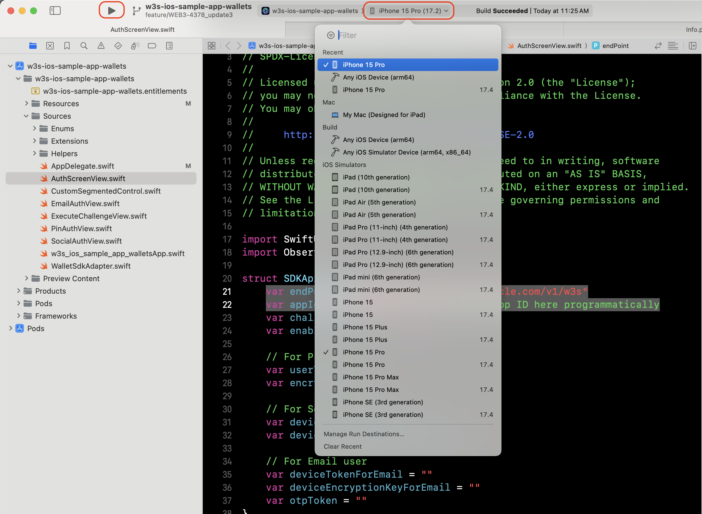
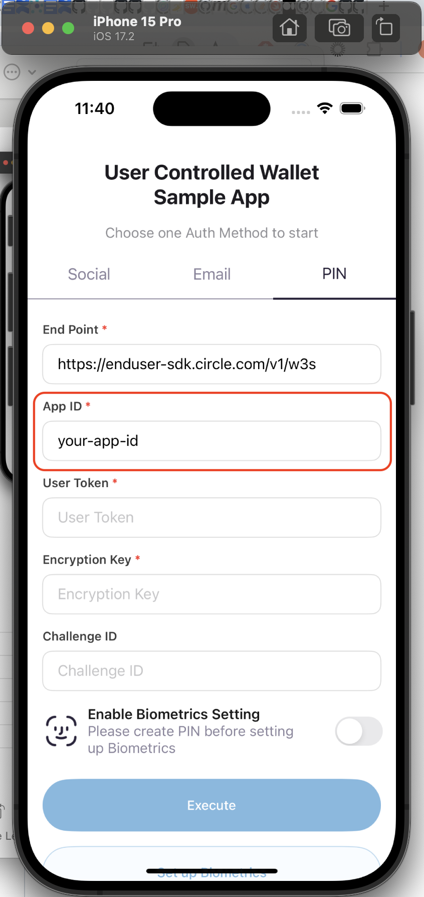
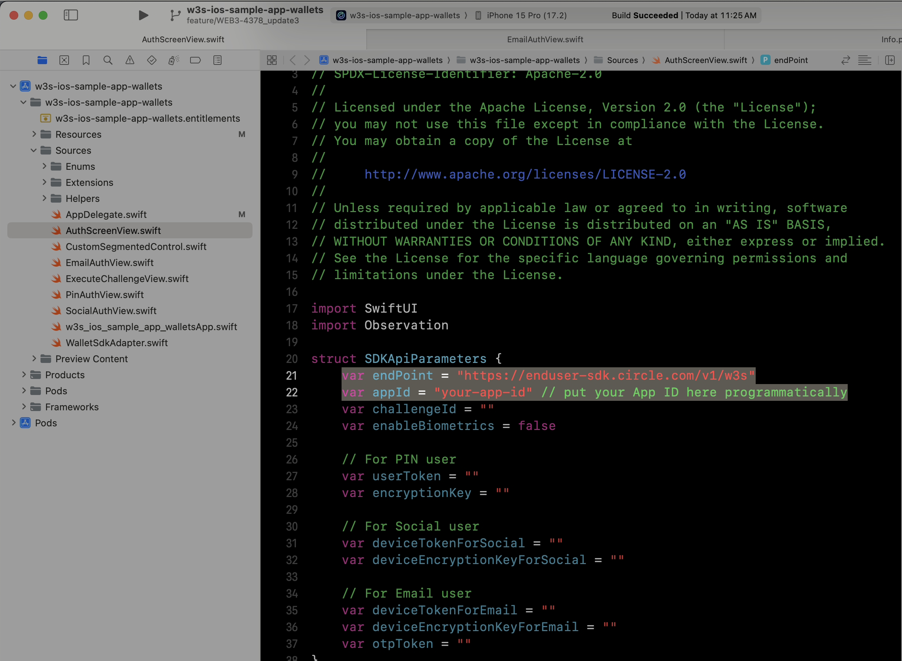

# w3s-ios-sample-app-wallets

This is a sample project to integrate with [CircleProgrammableWalletSDK](https://github.com/circlefin/w3s-ios-sdk)

- Bookmark
  - [Requirements](#requirements)
  - [Installation](#installation)
  - [Run the project](#run-the-project)

---

## Requirements

### Circle Developer Account

Sign up for the Circle Developer account here: https://console.circle.com/signup

Within the Circle Developer account, you can create and update API Keys, subscribe for activity notifications, view your API logs and more! Anyone can sign up for a Circle Developer account within minutes. All you need is your name, email and password!

### Xcode 14.1+

Install Apple’s Xcode development software: [Xcode in the Apple App Store](https://apps.apple.com/tw/app/xcode/id497799835?mt=12).

### CocoaPods

**CocoaPods** is a dependency manager for iOS projects. [Install CocoaPods by Homebrew](https://formulae.brew.sh/formula/cocoapods). (suggestion)

> Check if Homebrew is installed:

```shell
$ brew
```

> How to install Homebrew in MacOS: [Link](https://mac.install.guide/homebrew/3.html)

## Installation (with Terminal)

1. Clone this repo
2. Open project folder `$ cd Sample\ App/`
3. Run `$ pod install` to install `CircleProgrammableWalletSDK`
4. Open the `.xcworkspace` file (white one) in the finder.


> Run `$ pod update` for SDK updating. (Optional)

## Run the project (with Xcode)

1. Select a simulator as run target
2. press `Run` button (Command + R)


3. Set your `AppID` from simulator, and it will be stored in database.


4. (Optional) Setup configs programmatically

    
    - Set the `endPoint` in the `AuthScreenView.swift`
    - Set the `appId` in the `AuthScreenView.swift`

5. (Optional) Auth configs setup

	Just set up the social login you want to use below:
	 - [Apple] Update the App's Bundle Identifier to yours
	 
	 - [Google] Update `Info.plist` file to add your OAuth client ID and a custom URL scheme based on the reversed client ID.
	Reference: [Get started with Google Sign-In for iOS](https://developers.google.com/identity/sign-in/ios/start-integrating#configure_app_project)
	 
	 - [Facebook] Replace the *APP-ID*, *CLIENT-TOKEN* and *APP-NAME* of `Info.plist` with your Facebook application configurations. 
	Reference: [Facebook Login for iOS - Quickstart](https://developers.facebook.com/docs/facebook-login/ios/#4--configure-your-project)
	 
